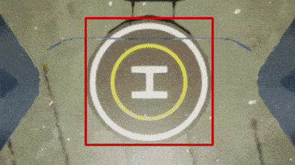
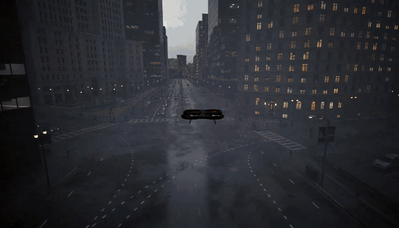
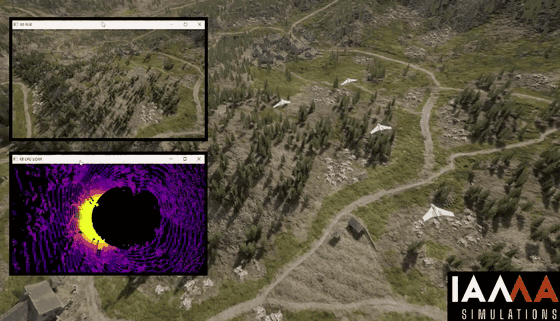
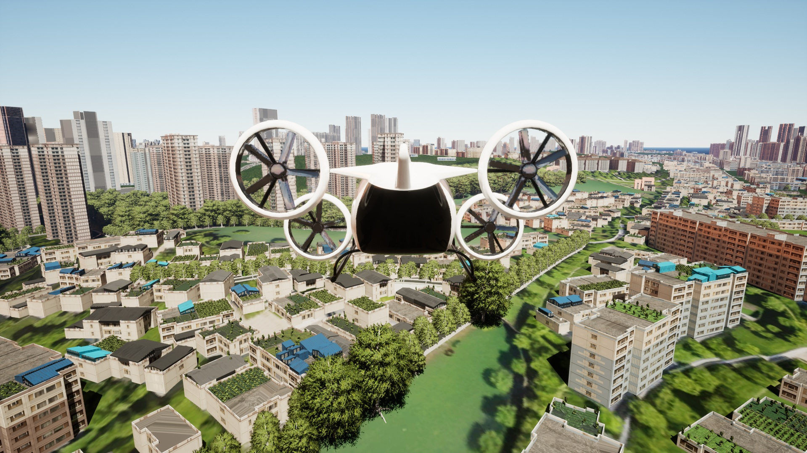
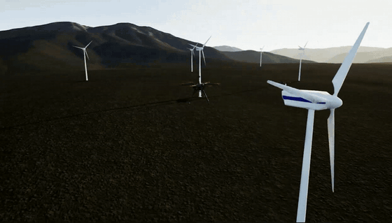
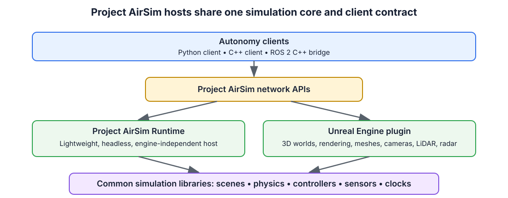

# Project AirSim

<div align="center">

[](https://github.com/iamaisim/ProjectAirSim/actions/workflows/sphinx-docs.yml)
[](https://github.com/iamaisim/ProjectAirSim/actions/workflows/test_linux_simlibs_release.yml)
[](https://github.com/iamaisim/ProjectAirSim/actions/workflows/test_windows.yml)
[](https://github.com/iamaisim/ProjectAirSim/actions/workflows/test_cpp_client.yml)

[](https://github.com/iamaisim/ProjectAirSim/releases/latest)
[](docs/development/dev_setup_linux.md)
[](docs/development/use_source.md)
[](docs/ros/ros2.md)
[](docs/client_setup.md)
[](docs/license.md)
[](https://iamaisim.com/)

</div>

Project AirSim is an open-source, extensible, engine-independent simulation
platform for autonomous systems. Its simulation core and APIs can run in the
lightweight [Project AirSim Runtime](samples/projectairsim_runtime/README.md)
without Unreal Engine, or with [Unreal Engine 5](https://www.unrealengine.com/)
when a 3D world, rendered sensors, and environment geometry are required.

Integrate an autonomy stack with the Project AirSim APIs, reuse compatible
scene and robot configurations, and select the simulation host that fits each
test. Use Runtime for fast controller, API, physics, automation, and CI
workflows; move the same integration to Unreal when the scenario requires
visual fidelity, cameras, LiDAR, radar, or mesh-based interaction. This lets a
team vary simulation cost and fidelity without maintaining a separate client
integration for every host.

Project AirSim builds on the work of
[AirSim](https://github.com/microsoft/AirSim) and provides a modular framework
for drones, fixed-wing aircraft, robots, and other autonomous systems.

**[Download the latest release](https://github.com/iamaisim/ProjectAirSim/releases/latest)** ·
**[Use a pre-built environment](docs/development/use_prebuilt.md)** ·
**[Build from source](docs/development/use_source.md)** ·
**[Read the documentation](https://iamaisim.github.io/ProjectAirSim/)**

<table>
<tr>
<td width="50%"><br><sub><b>Autonomous Landing.</b> Perception-guided vehicle control with a live camera stream.</sub></td>
<td width="50%"><br><sub><b>Adjustable Weather.</b> Change environmental conditions while the simulation is running.</sub></td>
</tr>
<tr>
<td width="50%"><br><sub><b>Simulate Your Swarm.</b> Run multiple vehicles together in a shared simulation.</sub></td>
<td width="50%"><br><sub><b>Dynamic City.</b> An air taxi operating in a dense Unreal city environment.</sub></td>
</tr>
<tr>
<td width="50%"><br><sub><b>Wind Turbine Inspection.</b> Inspect renewable-energy infrastructure in a large Unreal environment.</sub></td>
<td width="50%"><br><sub><b>Large Tilt-Rotor VTOL Fixed-Wing + Cesium.</b> Simulate VTOL flight over geospatial Cesium terrain.</sub></td>
</tr>
</table>

## Table of Contents

- [Current Repository Capabilities](#current-repository-capabilities)
- [Choose Your Starting Point](#choose-your-starting-point)
- [Latest Project Updates](#latest-project-updates)
- [Architecture](#architecture)
- [Key Integrations and Reference Documentation](#key-integrations-and-reference-documentation)
- [Supported Development Platforms](#supported-development-platforms)
- [Source Build Overview](#source-build-overview)
- [Headless Execution](#headless-execution)
- [Community and Contributions](#community-and-contributions)
- [Licensing](#third-party-interoperability-and-licensing)

## Current Repository Capabilities

The current `main` branch lets you:

- Create configurable single-vehicle and multi-vehicle simulation scenes.
- Use built-in C++ Fast Physics, JSBSim flight dynamics, Simulink physics
  models, or extend the C++ physics layer for custom requirements.
- Use Simple Flight, PX4 in software-in-the-loop (SITL) or
  hardware-in-the-loop (HITL), ArduPilot SITL, and manual control workflows.
- Integrate custom controllers, actuators, sensors, and robot models.
- Simulate fixed-wing aircraft with JSBSim, including Cessna 310 and Skywalker
  X8 examples.
- Connect autonomy software through Python and C++ client libraries or the ROS 2
  C++ bridge.
- Work with cameras, LiDAR, radar, IMU, GPS, barometer, magnetometer, airspeed,
  and other configurable sensors.
- Run with Unreal rendering, off-screen rendering, or without rendering for
  controller, API, and physics development.

Published binaries may trail the `main` branch. Check the
[release notes](https://github.com/iamaisim/ProjectAirSim/releases) to confirm
which capabilities are included in a particular package, and see the
[changelog](docs/changelog.md) for repository changes.

## Choose Your Starting Point

### Run a Pre-built Environment

> I want to evaluate Project AirSim, launch an environment, and control a
> vehicle with Python.

Download a packaged environment from
[GitHub Releases](https://github.com/iamaisim/ProjectAirSim/releases), then
follow the [pre-built environment guide](docs/development/use_prebuilt.md).

### Build and Extend Project AirSim

> I want to customize the simulation core, Unreal plugin, vehicles, sensors, or
> environments.

Follow the [source development guide](docs/development/use_source.md) to build
the simulation libraries, plugin, Blocks environment, and client packages.

### Run Without Unreal Engine

> I need a fast, headless simulation host for controllers, APIs, physics,
> automation, or CI without changing my Project AirSim client integration.

Use [Project AirSim Runtime](samples/projectairsim_runtime/README.md), the
lightweight, engine-independent host. It runs the same `SimServer`, Project
AirSim physics, controllers, APIs, and non-rendered sensors without requiring
Unreal Engine.

Runtime supports Fast Physics, JSBSim, Simulink physics, flight-controller
workflows, and sensors including GPS, IMU, barometer, magnetometer, and
airspeed. It does not provide cameras, LiDAR, radar, Unreal world meshes, or
general mesh and robot-to-robot collisions. Its host-side collision support is
limited to a flat ground plane for Fast Physics vehicles.

### Migrate from AirSim

> I have an existing AirSim environment or client workflow.

Start with the [AirSim transition guide](docs/transition_from_airsim.md).

## Latest Project Updates

The current `main` branch contains the changes recorded for Project AirSim
0.3.0, including:

- JSBSim fixed-wing simulation with Cessna 310 and Skywalker X8 examples;
- a standalone C++ client package and ROS 2 C++ bridge;
- GPU LiDAR 360-degree scanning and additional LiDAR validation;
- a Python client `step()` API; and
- improved build, toolchain, and CI support for Unreal Engine 5.7.

See [Project AirSim releases](https://github.com/iamaisim/ProjectAirSim/releases)
for the latest published binaries and release notes.

## Architecture

Project AirSim has three primary layers:

1. **Simulation libraries** provide the base infrastructure for defining robot
   structures, physics, controllers, sensors, and the simulation scene tick
   loop.
2. **Simulation host** provides the environment-dependent services. Project
   AirSim Runtime offers lightweight engine-independent execution, while the
   Unreal Engine plugin adds 3D environments, rendering, mesh interaction, and
   rendered sensors.
3. **Client libraries** expose network APIs for loading scenes, controlling
   vehicles, and receiving state and sensor data.



For more detail, see the
[Project AirSim architecture overview](docs/development/use_source.md#airsim-v-next-architecture-overview).

### Experimental Unity Host Reference

The repository also contains an
[experimental Unity host integration](unity/README.md) composed of a Unity
example project and a native wrapper around the Project AirSim simulation
libraries. It is retained as reference code that demonstrates how another 3D
engine can host the common simulation core.

The Unity integration is **not currently maintained, validated, packaged, or
supported by IAMAI** and is not part of the supported-platform matrix. Do not
assume compatibility with current Project AirSim or Unity releases.

## Key Integrations and Reference Documentation

- [Configuration overview](docs/config.md)
- [Scene configuration](docs/config_scene.md)
- [Robot configuration](docs/config_robot.md)
- [Client API](docs/api.md)
- [Flight controllers](docs/controllers/controllers.md)
- [PX4 integration](docs/controllers/px4/px4.md)
- [ArduPilot integration](docs/controllers/ardupilot.md)
- [Fast Physics](docs/physics/fast-physics.md)
- [JSBSim physics](docs/physics/jsbsim.md)
- [Simulink physics](docs/physics/matlab.md)
- [ROS 2 C++ bridge](docs/ros/ros2.md)
- [Sensor configuration](docs/config_robot.md#sensor-settings)
- [Headless and cloud execution](docs/development/headless_cloud.md)

## Supported Development Platforms

The supported development baseline is derived from the repository build scripts
and package metadata:

| Component | Supported version or behavior |
| --- | --- |
| Linux | **Ubuntu 22.04** is the primary supported distribution |
| Windows | **Windows 11** with Visual Studio 2022 C++ build tools |
| Unreal Engine | **5.2 or 5.7** |
| CMake and C++ | CMake **3.15 or newer** and C++17 |
| Linux compiler | Unreal's packaged toolchain when `UE_ROOT` is set; otherwise Clang 13 |
| Windows compiler | `build.cmd` selects MSVC 14.37 for UE 5.2 and MSVC 14.44 for UE 5.7 |
| Python client | Python **3.7 or newer**, below Python 4 |
| ROS 2 C++ bridge | **ROS 2 Humble** on Ubuntu 22.04 |

`setup_linux_dev_tools.sh` recognizes some additional Ubuntu releases, but that
installation logic is not a supported-platform guarantee. Use Ubuntu 22.04 for
the documented and CI-tested Linux development environment.

Hardware requirements are primarily determined by Unreal Engine and the
rendering workload. Review the [system specifications](docs/system_specs.md)
before installing or building the project.

## Source Build Overview

The complete and authoritative instructions are in the
[source development guide](docs/development/use_source.md). The basic workflow
is summarized below.

### 1. Install Unreal Engine

Install Unreal Engine 5.2 or 5.7 and set `UE_ROOT` to its installation path.

On Linux:

```bash
export UE_ROOT=/path/to/UnrealEngine
```

### 2. Install Linux Development Dependencies

```bash
./setup_linux_dev_tools.sh
```

### 3. Build the Simulation Libraries

On Linux:

```bash
./build.sh simlibs_debug
```

On Windows, use an **x64 Native Tools Command Prompt for VS 2022**:

```cmd
build.cmd simlibs_debug
```

### 4. Generate Project Files

On Linux:

```bash
./blocks_genprojfiles_vscode.sh
```

On Windows:

```cmd
blocks_genprojfiles_vscode.bat
```

Open the generated workspace and launch the Unreal Editor in DebugGame mode.

## Headless Execution

To run a packaged Unreal environment with off-screen rendering:

```text
Blocks{.exe/.sh} -RenderOffScreen
```

To disable rendering completely:

```text
Blocks{.exe/.sh} -nullrhi
```

See [headless and cloud execution](docs/development/headless_cloud.md) for
additional configuration details.

## Open Source and Professional Services

Project AirSim's simulation core, APIs, configuration system, extension points,
and reference workflows are available publicly under the MIT License. We want
the open-source project to be useful for evaluation, research, development, and
real autonomy workflows.

[IAMAI Consulting Corp.](https://www.iamaisim.com) maintains and extends the
Project AirSim ecosystem. The team includes former Microsoft AirSim engineers
and provides professional services for organizations that need to turn a
prototype into a repeatable simulation or validation workflow.

IAMAI can help with:

- simulation-readiness and architecture assessments;
- PX4, ROS 2, JSBSim, vehicle, sensor, and autonomy-stack integration;
- custom Unreal Engine environments and simulation workflows;
- reproducible scenarios and validated builds; and
- maintained delivery, updates, and engineering support.

If you have an upcoming integration, demonstration, pilot, or validation
milestone, **[talk to IAMAI](https://www.iamaisim.com)** about a focused first
engagement.

## Community and Contributions

Project AirSim grows through practical use, technical feedback, and community
contributions.

- [Report a bug or request a feature](https://github.com/iamaisim/ProjectAirSim/issues/new/choose)
- [Start a GitHub Discussion](https://github.com/iamaisim/ProjectAirSim/discussions)
- [Join the Project AirSim Discord](https://discord.gg/XprQ2w64uj)
- Submit focused pull requests for code, tests, documentation, and examples

The roadmap is managed through GitHub issues and discussions. Items labeled
[`roadmap`](https://github.com/iamaisim/ProjectAirSim/labels/roadmap) describe
planned direction, while items labeled
[`need help`](https://github.com/iamaisim/ProjectAirSim/labels/need%20help)
identify opportunities for community participation.

## Third-Party Interoperability and Licensing

Project AirSim interoperates with third-party engines, libraries, models, and
tools, including JSBSim-compatible aircraft definitions. Those components and
assets remain under their respective licenses.

Before redistributing or extending an integration, review
[Project AirSim license information](docs/license.md), `NOTICE.txt`, and the
licenses under `thirdparty/Licenses/`.

---

Copyright (C) Microsoft Corporation.  
Copyright (C) 2025-2026 IAMAI CONSULTING CORP

MIT License
