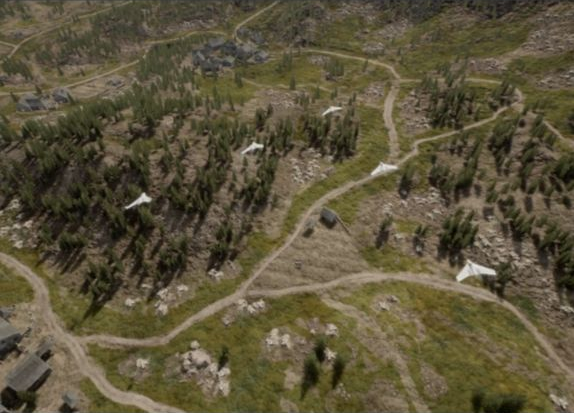

# JSBSim Physics

Project AirSim includes JSBSim integration for aircraft dynamics.

## Getting Started

JSBSim examples live under `client/python/example_user_scripts/jsbsim/` and are grouped by airframe:

| Path | Purpose |
| ---- | ------- |
| `cessna_310/` | Cessna 310 example script and sim configs |
| `x8_skywalker/` | Skywalker X8 scripts, tests, and sim configs |

### Prerequisites

1. Complete [Client Setup](../client_setup.md) (Python client installed, virtual environment activated).
2. Launch the Project AirSim simulation server.

## Cessna 310 example

Files:

| Path | Purpose |
| ---- | ------- |
| `cessna_310/hello_c310_jsbsim.py` | Connects, loads the scene, performs a short takeoff/turn/landing demo |
| `cessna_310/sim_config/scene_c310_jsbsim.jsonc` | Scene config for the C310 example |
| `cessna_310/sim_config/robot_c310_jsbsim.jsonc` | Robot config for the C310 example |

Run it from the repository root:

```bash
python client/python/example_user_scripts/jsbsim/cessna_310/hello_c310_jsbsim.py
```

## Skywalker X8 examples



Files:

| Path | Purpose |
| ---- | ------- |
| `x8_skywalker/hello_x8_jsbsim.py` | Loads the X8 scene, seeds an air launch, and flies a waypoint circuit |
| `x8_skywalker/x8_autopilot.py` | Reusable heading, altitude, airspeed, pitch, and roll controller |
| `x8_skywalker/run_x8_forest_swarm.py` | Runs the X8 swarm example in Forest/MountainVillage |
| `x8_skywalker/test_x8_autopilot.py` | Unit tests for the X8 autopilot helper |
| `x8_skywalker/sim_config/scene_x8_jsbsim.jsonc` | Paused steppable-clock scene for a single X8 |
| `x8_skywalker/sim_config/robot_x8_jsbsim.jsonc` | X8 JSBSim robot config |

Run the single-aircraft example:

```bash
python client/python/example_user_scripts/jsbsim/x8_skywalker/hello_x8_jsbsim.py
```

Optional longer run:

```bash
python client/python/example_user_scripts/jsbsim/x8_skywalker/hello_x8_jsbsim.py --max-sim-time 120
```

The swarm example generates its scene at runtime and reuses the same X8 robot config.

## Ground Height Mode

JSBSim robots support two ground height modes through the robot config field
`jsbsim-ground-mode`:

```jsonc
{
  "physics-type": "jsbsim-physics",
  "jsbsim-ground-mode": "constant"
}
```

| Mode | Behavior |
| ---- | -------- |
| `constant` | Default. Uses the terrain/floor height at the initial robot position as one fixed ground height for the whole simulation. Falls back to the scene `home-geo-point.altitude` if no terrain sample is available. |
| `terrain` | Samples the Unreal terrain/floor height during the simulation. |

### Terrain Callback Usage

Project AirSim builds a terrain-elevation callback when JSBSim initializes. The
callback samples the robot's cached terrain elevation first, then the scene
terrain callback, and finally falls back to the scene `home-geo-point.altitude`.
That initial sample is used to set JSBSim's initial terrain elevation before
`RunIC()`.

After initialization, the callback installed into JSBSim depends on
`jsbsim-ground-mode`:

| Mode | JSBSim callback | Runtime usage |
| ---- | --------------- | ------------- |
| `constant` | `JSBSimConstantGroundCallback` | The Project AirSim terrain callback is sampled once at initialization. During the simulation, JSBSim receives the same fixed terrain elevation for every `GetAGLevel()` query. Unreal terrain is not queried again for JSBSim ground height. |
| `terrain` | `JSBSimTerrainGroundCallback` | JSBSim calls back during `GetAGLevel()` queries. The callback converts JSBSim latitude/longitude to Project AirSim NED coordinates, samples the scene terrain elevation at that location, and updates JSBSim's terrain elevation before JSBSim computes AGL/contact data. If the sample is invalid, the last valid value is reused, then the home altitude fallback is used. |

These callbacks feed JSBSim's internal ground-height calculations, including
height-above-ground and contact-related state. Project AirSim's own collision
response path, such as `NeedsCollisionResponse()` and
`CalcNextKinematicsWithCollision()`, is separate from the JSBSim terrain
callback.

## Timestep

JSBSim robots support a configurable internal physics timestep through the
robot config field `jsbsim-dt`, in seconds:

```jsonc
{
  "physics-type": "jsbsim-physics",
  "jsbsim-model": "c310",
  "jsbsim-dt": 0.008333333333333333
}
```

If `jsbsim-dt` is omitted, Project AirSim uses `1/120` s
(`0.008333333333333333`, or 120 Hz).

## Known Issues

1. **Flat ground surface (no mesh following)**
   - In `constant` ground mode, the simulated ground is flat at the terrain/floor height sampled at the initial robot position. Different parts of the vehicle cannot rest at different heights on sloped terrain. There is no mesh-following behavior after initialization.
   - In `terrain` ground mode, JSBSim samples terrain height at several contact points and has the capacity to respond to irregular ground surfaces.

2. **Ground penetration during sustained ground movement**
   - If a JSBSim vehicle continuously advances on the ground, it slowly sinks over time until it fully penetrates the terrain surface.

---

Copyright (C) IAMAI CONSULTING CORP

MIT License. All rights reserved.
