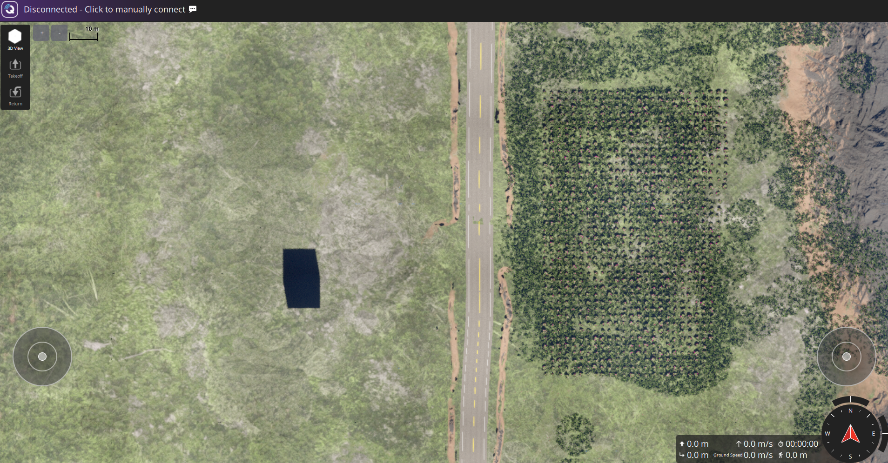

# Tile Camera and HTTP Tile Server Actors

This page explains how to use the tile actors added to the `ProjectAirSim` Unreal plugin:

- `ATileCameraActor` - maps XYZ tile coordinates to a camera world position and sets orthographic width.
- `ATileHttpServerActor` - serves tile PNG files over HTTP from disk and can render missing tiles on demand through `ATileCameraActor`.
- `UTileMercatorLibrary` - helper library used by both actors to convert tile coordinates to Unreal world coordinates.

The source files are located in:

- `unreal/Blocks/Plugins/ProjectAirSim/Source/ProjectAirSim/Private/Tiles/TileCameraActor.*`
- `unreal/Blocks/Plugins/ProjectAirSim/Source/ProjectAirSim/Private/Tiles/TileHttpServerActor.*`
- `unreal/Blocks/Plugins/ProjectAirSim/Source/ProjectAirSim/Private/Tiles/TileMercatorLibrary.*`



## Prerequisites

1. Use a build that includes the tile actor commit.
2. Ensure the plugin compiles with `HTTPServer` enabled in module dependencies.
3. Open your Unreal level and place the actors from the ProjectAirSim plugin classes.

## How to use `ATileCameraActor`

`ATileCameraActor` is responsible for computing camera transform and ortho width for one map tile.

1. Place a `TileCameraActor` in the level.
2. Configure these key properties in Details panel:
   - `Zoom`, `TileX`, `TileY`
   - `OriginLat`, `OriginLon` (reference lat/lon mapped to Unreal world origin Same as setted in Jsonc)
   - `AltitudeMeters`
   - `bTileYIsTMS` if your Y index uses TMS format
   - `bUseMercatorScale` to match standard WebMercator tile size behavior (I use it False, True case was not working very well)
3. Enable `bUpdateOnBeginPlay` for one-time initialization or `bUpdateEveryTick` for continuous updates.
4. If you need immediate capture output, enable `bCaptureAfterUpdate`.

Notes:

- The actor uses a `SceneCaptureComponent2D` and defaults to orthographic projection.
- `bNorthIsX` controls axis convention:
  - `false`: X=East, Y=North
  - `true`: X=North, Y=East

## How to use `ATileHttpServerActor`

`ATileHttpServerActor` exposes tiles over HTTP with route:

- `GET /tiles/:z/:x/:y`

### Basic file-server mode (cache only)

1. Place a `TileHttpServerActor` in the level.
2. Set:
   - `Port` (default `8080`)
   - `RoutePrefix` (default `/tiles`)
   - `TileRootDir` (default `Saved/Tiles` when relative)
   - `MinZoom`, `MaxZoom`
3. Keep `bRenderMissingTiles = false`.
4. Start play. Existing files at `TileRootDir/z/x/y.png` are served directly.

### On-demand render mode (render missing tiles)

1. Place both `TileCameraActor` and `TileHttpServerActor` in the level.
2. In `TileHttpServerActor`, set:
   - `bRenderMissingTiles = true`
   - `TileCamera = <your TileCameraActor instance>`
3. Optionally set `TileSize` (default `256`) and `bTileYIsTMS`.
4. When a tile is missing on disk, the server renders it, returns PNG bytes, and saves to cache.

## Request examples

With default settings (`Port=8080`, `RoutePrefix=/tiles`):

```bash
curl -o tile.png http://127.0.0.1:8080/tiles/20/0/0
```

PNG extension in URL is also accepted:

```bash
curl -o tile.png http://127.0.0.1:8080/tiles/20/0/0.png
```

## Tile directory layout

Rendered or pre-generated tiles are expected/saved as:

```text
<TileRootDir>/<z>/<x>/<y>.png
```

If `TileRootDir` is relative (for example, `Tiles`), absolute location becomes:

```text
<ProjectSavedDir>/Tiles
```
