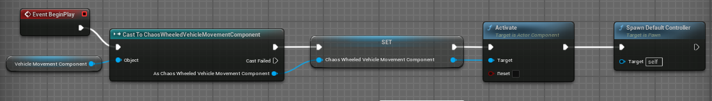
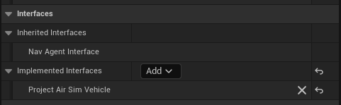
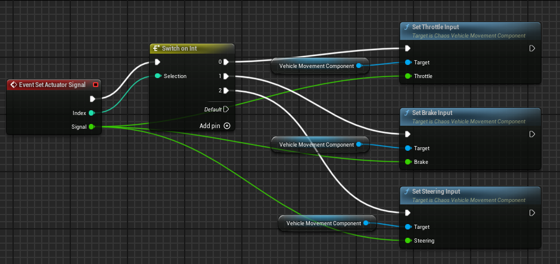

# Blueprint Setup for Unreal Vehicles

This guide documents how to create and configure Blueprints in Unreal Engine 5 to use them as **Unreal Vehicles** in Project AirSim. An Unreal Vehicle is a UE5 AActor whose dynamics (physics) live entirely within Unreal Engine, while Project AirSim sends actuator signals to it and reads its kinematics.

## Table of Contents

- [Overview](#overview)
- [Unreal Vehicle vs Regular Actor](#unreal-vehicle-vs-regular-actor)
- [Step 1: Create the Actor Blueprint](#step-1-create-the-actor-blueprint)
- [Step 2: Implement the IUnrealVehicleActor Interface](#step-2-implement-the-iunrealvehicleactor-interface)
- [Step 3: Implement SetActuatorSignal in the Blueprint](#step-3-implement-setactuatorsignal-in-the-blueprint)
- [Step 4: (Optional) Implement GetActuatorSignal](#step-4-optional-implement-getactuatorsignal)
- [Step 5: Configure the Robot JSON](#step-5-configure-the-robot-json)
- [Step 6: Configure the Scene JSON](#step-6-configure-the-scene-json)
- [Step 7: Control It from Python](#step-7-control-it-from-python)

---

## Overview

The **Unreal Vehicle** system allows you to use an Unreal Engine vehicle AActor in Project AirSim without needing to define links, joints, or actuators in configuration files. The vehicle physics are handled entirely by UE5 (Chaos Vehicle or another Unreal vehicle movement component), and Project AirSim acts solely as a bridge:

1. **Sends** named control parameters (throttle, steering, brake, etc.) to the Blueprint
2. **Reads** kinematics (position, velocity, acceleration) from the actor every tick
3. **Exposes** kinematics to the Python client via the existing robot API

```
┌──────────────┐     parameters      ┌──────────────────────┐
│ Python Client │ ──────────────────► │  IUnrealVehicleActor│
│(set_parameter)│                     │  (Blueprint in UE5)   │
│               │ ◄────────────────── │                       │
│ (get_kinem.) │     kinematics      │  Chaos/PhysX Physics  │
└──────────────┘                     └──────────────────────┘
```

### Chaos Vehicle Plugin Requirement

For Chaos vehicle pawns, the Unreal project must have the **Chaos Vehicles** plugin enabled.
The Blocks environment is delivered with this already configured in:

```jsonc
// unreal/Blocks/Blocks.uproject
{
  "Name": "ChaosVehiclesPlugin",
  "Enabled": true
}
```

If you create another Unreal/PAS environment, enable **Chaos Vehicles** from
**Edit > Plugins > Vehicles > Chaos Vehicles**, then restart the Unreal Editor
before opening or compiling the vehicle Blueprint.

---

## Unreal Vehicle vs Regular Actor

| Aspect | Regular Actor | Unreal Vehicle |
|--------|---------------|----------------|
| **physics-type** | `fast-physics`, `unreal-physics` | `unreal-physics` with `unreal-vehicle-class` |
| **Physics engine** | ProjectAirSim Core Sim | Native UE5 (Chaos/PhysX) |
| **Links / Joints** | Required in JSON | Not needed |
| **Actuators** | Defined in JSON config | Defined in the Blueprint |
| **Kinematics** | Computed by the sim | Read from the UE5 actor |
| **Controller type** | `simple-flight-api`, `simple-drive-api`, etc. | `unreal-vehicle-api` |

---

## Step 1: Create the Actor Blueprint

### Option A: Chaos Vehicle

1. In the **Content Browser**, right-click → **Blueprint Class**
2. Select **WheeledVehiclePawn** as the parent class
3. Name it, e.g.: `BP_MyVehicle`
4. Open the Blueprint and add:
   - A **Skeletal Mesh Component** with the vehicle mesh
   - A **ChaosWheeledVehicleMovementComponent** (included with WheeledVehiclePawn)
   - Configure wheels (Front/Rear Wheel classes)
   - Configure the engine torque curve

#### BeginPlay Setup (Required for Chaos Vehicles)

Chaos Vehicles require two specific calls in **Event BeginPlay** to function correctly when spawned by Project AirSim. Without these, the vehicle movement component will remain inactive and the vehicle will not respond to any input.

**In the Event Graph, add an Event BeginPlay node and wire the following:**



```
Event BeginPlay
│
├── Get Vehicle Movement Component
│   └── Cast to ChaosWheeledVehicleMovementComponent
│       └── Activate (Component Activate)
│
└── Spawn Default Controller
```

**Step-by-step:**

1. Add an **Event BeginPlay** node
2. Call **Get Vehicle Movement Component** and cast it to **ChaosWheeledVehicleMovementComponent**
3. Store the cast result in the **Chaos Wheeled Vehicle Movement Component** variable
4. Call **Activate** on the movement component — this activates the Chaos physics simulation on the vehicle. Without it, the component stays dormant and ignores all throttle/brake/steering input.
5. Call **Spawn Default Controller** — this creates the AIController (or the default controller class assigned in the Blueprint's Class Defaults). Without a controller, the Pawn does not process movement input, so actuator signals from Project AirSim have no effect.

> **Why is this needed?** When Project AirSim spawns the unreal vehicle at runtime, the ChaosWheeledVehicleMovementComponent starts in an inactive state and no controller is automatically possessed. These two calls ensure the vehicle is fully operational and ready to receive actuator signals.

### Option B: Generic Actor with Physics

1. In the **Content Browser**, right-click → **Blueprint Class**
2. Select **Pawn** or **Actor** as the parent class
3. Name it, e.g.: `BP_MyRobot`
4. Add a **Static Mesh Component** or **Skeletal Mesh Component** with physics enabled (`Simulate Physics = true`)

---

## Step 2: Implement the IUnrealVehicleActor Interface

This is the most important step. The `IUnrealVehicleActor` interface is what allows Project AirSim to communicate with your Blueprint.

### In the Blueprint Editor:

1. Open your Blueprint (e.g.: `BP_MyVehicle`)
2. Go to **Class Settings** (button in the top toolbar)
3. In the **Details** panel, find the **Interfaces** section
4. Click **Add** → search for **UnrealVehicleActor**
5. Select **UnrealVehicleActor** from the list
6. Click **Compile** and **Save**

The interface should appear under **Implemented Interfaces** as shown below:



After adding the interface, you will see the interface functions in the **My Blueprint** panel under the **Interfaces** section:

- `SetActuatorSignal` (Index: Int, Signal: Float)
- `GetActuatorSignal` (Name: String) → Float
- `GetLinearVelocity` → Vector
- `GetAngularVelocity` → Vector
- `GetLinearAcceleration` → Vector
- `GetAngularAcceleration` → Vector

---

## Step 3: Implement SetActuatorSignal in the Blueprint

This is the **required** function you must implement. It is called every sim tick to deliver control signals.

### For a Chaos Vehicle:

1. In the **My Blueprint** panel → **Interfaces**, double-click `SetActuatorSignal`
2. The Event Graph will open with the event node
3. Implement the logic using a **Switch on Int** node with the `Index` parameter.

The `Index` comes from the actuator array order in your robot JSONC config:

```jsonc
"actuators": [
  {"name": "throttle", "default-value": 0.0}, // Index 0
  {"name": "brake", "default-value": 0.0},    // Index 1
  {"name": "steering", "default-value": 0.0}  // Index 2
]
```

For this config, your Blueprint mapping is:

- `0` -> throttle
- `1` -> brake
- `2` -> steering

```
Event: SetActuatorSignal (Index, Signal)
│
├── Switch on Int (Index)
│   │
│   ├── 0 ──► Set Throttle Input (Signal)
│   │                   [ChaosWheeledVehicleMovementComponent]
│   │
│   ├── 1 ──► Set Brake Input (Signal)
│   │                   [ChaosWheeledVehicleMovementComponent]
│   │
│   └── 2 ──► Set Steering Input (Signal)
│                       [ChaosWheeledVehicleMovementComponent]
```

**Step-by-step implementation in the Event Graph:**

1. From the execution pin of the `SetActuatorSignal` event, drag and create a **Switch on Int** node
2. Connect the **Selection** pin to the **Index** parameter
3. Add three cases: `0`, `1`, `2`
4. For each case:
   - Drag a reference to the **ChaosWheeledVehicleMovement** component
   - Call the corresponding function:
     - `0` (throttle) → **Set Throttle Input** (passing **Signal** as the value)
     - `1` (brake) → **Set Brake Input** (passing **Signal** as the value)
     - `2` (steering) → **Set Steering Input** (passing **Signal** as the value)

The completed Blueprint graph should look like this:



### For a Generic Actor (Direct Forces):

```
Event: SetActuatorSignal (Index, Signal)
│
├── Switch on Int (Index)
│   │
│   ├── 0 (force_x)  ──► Add Force (MeshComponent)
│   │                   Force: (Signal * MaxForce, 0, 0)
│   │
│   ├── 1 (force_y)  ──► Add Force (MeshComponent)
│   │                   Force: (0, Signal * MaxForce, 0)
│   │
│   ├── 2 (force_z)  ──► Add Force (MeshComponent)
│   │                   Force: (0, 0, Signal * MaxForce)
│   │
│   ├── 3 (roll)     ──► Add Torque (MeshComponent)
│   │                   Torque: (Signal * MaxTorque, 0, 0)
│   │
│   ├── 4 (pitch)    ──► Add Torque (MeshComponent)
│   │                   Torque: (0, Signal * MaxTorque, 0)
│   │
│   └── 5 (yaw)      ──► Add Torque (MeshComponent)
│                       Torque: (0, 0, Signal * MaxTorque)
```

> Important: If you change the actuator order in JSONC, update the index mapping in the Blueprint.

> **Unreal coordinate system:** X = Forward, Y = Right, Z = Up. Use `force_x` for forward thrust (ground vehicles), `force_z` for vertical thrust (drones). You only need to implement the actuators relevant to your actor.

## Step 4: (Optional) Implement GetActuatorSignal

If you stored the signals in a Map (previous step):

1. Double-click `GetActuatorSignal` in the Interfaces panel
2. Implement:

```
Function: GetActuatorSignal (Name) → Float
│
└── Find (ActuatorSignals Map, Name)
    └── Return Value (Float)
```

> **Note:** If you don't implement this function, it returns 0.0 by default. The system still works — you just won't be able to read the current actuator values from Python.

---

### Kinematics reading priority (automatic):

1. **Tier 1:** If the actor implements `IUnrealVehicleActor` and the methods return non-zero values, those values are used
2. **Tier 2:** If not, values are read directly from the actor's physics component (`GetPhysicsLinearVelocity`, etc.)
3. **Tier 3:** If there is no physics component, values are calculated via finite differences (current position - previous position)

### If you need to implement them (e.g., for a Chaos Vehicle):

**GetLinearVelocity** (cm/s in Unreal coordinates):
```
Function: GetLinearVelocity → Vector
│
└── Get Physics Linear Velocity (MeshComponent)
    └── Return Value (Vector)
```

**GetAngularVelocity** (rad/s in Unreal coordinates):
```
Function: GetAngularVelocity → Vector
│
└── Get Physics Angular Velocity In Radians (MeshComponent)
    └── Return Value (Vector)
```

> **Note on units:** Velocity vectors must be in **cm/s** (linear) and **rad/s** (angular) in **Unreal** coordinates (X=Forward, Y=Right, Z=Up). Project AirSim handles the conversion to NED internally.

---

## Step 5: Configure the Robot JSON

Create a robot configuration file. You don't need links or joints for unreal vehicles. Actuators are declared in the controller settings and mapped by index in your Blueprint.

### File: `robot_my_vehicle.jsonc`

```jsonc
{
  // Physics type: unreal-physics means UE5 handles the physics.
  // unreal-vehicle-class selects the Chaos vehicle actor path.
  "physics-type": "unreal-physics",

  // UE5 Blueprint class path
  // Format: "/[PluginOrGame]/Path/To/Blueprint.Blueprint_C"
  //
  // If the Blueprint is in the project's Content (Game):
  //   "/Game/MyFolder/BP_MyVehicle.BP_MyVehicle_C"
  //
  // If it's a C++ class:
  //   "/Script/MyModule.AMyVehicleActor"
  "unreal-vehicle-class": "/Game/Vehicles/BP_MyVehicle.BP_MyVehicle_C",

  // Controller of type unreal-vehicle-api
  "controller": {
    "id": "UnrealVehicleController",
    "type": "unreal-vehicle-api",
    "unreal-vehicle-api-settings": {
      // List of actuators the Blueprint understands.
      // The names MUST match those used in SetActuatorSignal.
      "actuators": [
        { "name": "throttle", "default-value": 0.0 },
        { "name": "brake",    "default-value": 0.0 },
        { "name": "steering", "default-value": 0.0 }
      ]
    }
  },

  // Optional sensors — they attach to the root and follow the actor's pose
  "sensors": [
    {
      "id": "FrontCamera",
      "type": "camera",
      "enabled": true,
      "capture-interval": 0.03,
      "capture-settings": [
        {
          "image-type": 0,
          "width": 640,
          "height": 480,
          "fov-degrees": 90,
          "capture-enabled": true,
          "streaming-enabled": true,
          "pixels-as-float": false,
          "compress": false,
          "target-gamma": 2.5
        }
      ],
      "origin": {
        "xyz": "2.0 0.0 -1.0",
        "rpy-deg": "0 0 0"
      }
    }
  ]
}
```

### Important Fields

| Field | Type | Description |
|-------|------|-------------|
| `physics-type` | string | Must be `"unreal-physics"` |
| `unreal-vehicle-class` | string | Full class path of the UE5 Blueprint. Must end in `_C` for Blueprints. If omitted, the system searches the world for any actor implementing the interface. |
| `controller.type` | string | Must be `"unreal-vehicle-api"` |
| `controller.unreal-vehicle-api-settings.actuators` | array | List of actuators with name and default value |
| `sensors` | array | Optional sensors (cameras, IMU, etc.) |

### How to Get the Blueprint Class Path

1. In the Unreal Editor **Content Browser**, right-click your Blueprint
2. Select **Copy Reference**
3. You'll get something like: `Blueprint'/Game/Vehicles/BP_MyVehicle.BP_MyVehicle'`
4. Modify it to the required format: `/Game/Vehicles/BP_MyVehicle.BP_MyVehicle_C`
   - Remove the `Blueprint'` prefix and the trailing `'`
   - Append `_C` at the end (indicates the compiled Blueprint class)

---

## Step 6: Configure the Scene JSON

Create the scene file that references your robot.

### File: `scene_my_vehicle.jsonc`

```jsonc
{
  "id": "MyVehicleScene",
  "actors": [
    {
      "type": "robot",
      "name": "MyVehicle",
      "origin": {
        "xyz": "0.0 0.0 -4.0",
        "rpy-deg": "0 0 0"
      },
      "robot-config": "robot_my_vehicle.jsonc"
    }
  ],
  "clock": {
    "type": "steppable",
    "step-ns": 3000000,
    "real-time-update-rate": 3000000,
    "pause-on-start": false
  },
  "home-geo-point": {
    "latitude": 47.641468,
    "longitude": -122.140165,
    "altitude": 122.0
  },
  "scene-type": "UnrealNative"
}
```

> **Note on origin:** The `origin.xyz` field is in NED meters (North-East-Down). A value of `z = -4.0` means 4 meters above the ground. Adjust based on the terrain height in your map.

---

## Step 7: Control It from Python

### Basic Script

```python
import asyncio
from projectairsim import ProjectAirSimClient, World
from projectairsim.unreal_vehicle import UnrealVehicle

async def main():
    client = ProjectAirSimClient()
    client.connect()

    # Load the scene with your configuration
    world = World(client, "scene_my_vehicle.jsonc", delay_after_load_sec=2)

    # Create the vehicle control object
    vehicle = UnrealVehicle(client, world, "MyVehicle")

    # Manual control: accelerate
    vehicle.set_parameter("throttle", 0.5)
    vehicle.set_parameter("brake", 0.0)
    vehicle.set_parameter("steering", 0.0)
    await asyncio.sleep(3.0)

    # Read kinematics
    kin = vehicle.get_kinematics()
    pos = kin.get("pose", {}).get("position", {})
    print(f"Position: x={pos.get('x'):.2f} y={pos.get('y'):.2f} z={pos.get('z'):.2f}")

    # Brake / stop
    vehicle.set_parameter("throttle", 0.0)
    vehicle.set_parameter("brake", 1.0)
    vehicle.set_parameter("steering", 0.0)

    client.disconnect()

asyncio.run(main())
```

### UnrealVehicle API

| Method | Description |
|--------|-------------|
| `set_parameter(name, value)` | Send a named control parameter to a Blueprint actuator |
| `get_kinematics()` → dict | Read position, velocity, acceleration of the actor |

> `follow_waypoints` and `drive_to` are helper functions shown in
> `client/python/example_user_scripts/hello_unreal_vehicle.py`, not methods
> on `UnrealVehicle` itself.

### Kinematics Data

`get_kinematics()` returns a dictionary with:

```python
{
  "time_stamp": int,
  "pose": {
    "position": {"x": float, "y": float, "z": float},
    "orientation": {"w": float, "x": float, "y": float, "z": float}
  },
  "twist": {
    "linear": {"x": float, "y": float, "z": float},
    "angular": {"x": float, "y": float, "z": float}
  },
  "accels": {
    "linear": {"x": float, "y": float, "z": float},
    "angular": {"x": float, "y": float, "z": float}
  }
}
```

> Values are provided in ProjectAirSim world conventions (NED in SI units).

---

## Reference JSON Configuration

The full working example is located at:
- Robot: `client/python/example_user_scripts/sim_config/robot_unreal_vehicle.jsonc`
- Scene: `client/python/example_user_scripts/sim_config/scene_unreal_vehicle.jsonc`
- Python script: `client/python/example_user_scripts/hello_unreal_vehicle.py`

---
